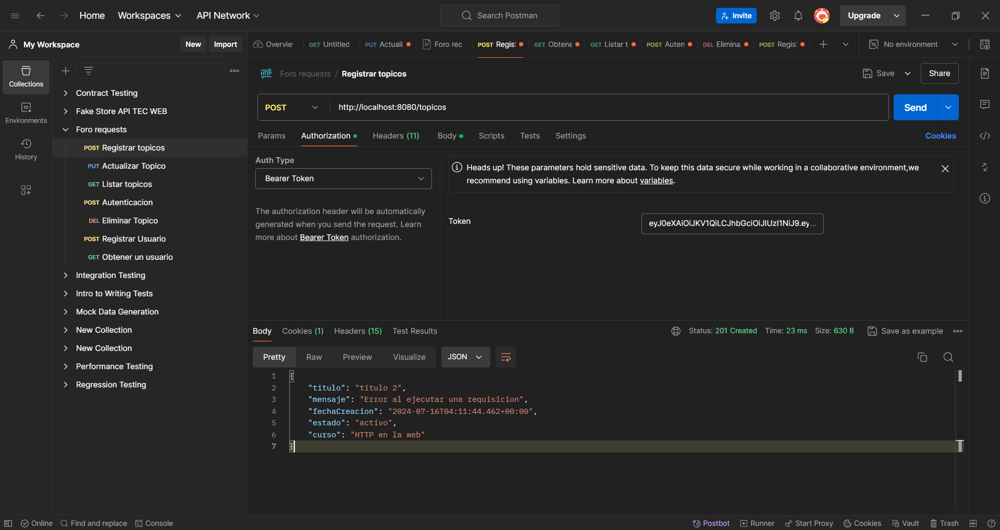

# Foro API 

## Índice

- [Descripción del Proyecto](#descripción-del-proyecto)
- [Estado del Proyecto](#estado-del-proyecto)
- [Demostración de Funciones y Aplicaciones](#demostración-de-funciones-y-aplicaciones)
- [Acceso al Proyecto](#acceso-al-proyecto)
- [Tecnologías Utilizadas](#tecnologías-utilizadas)
- [Personas Desarrolladoras del Proyecto](#personas-desarrolladoras-del-proyecto)

## Descripción del Proyecto

El proyecto "Foro" es una API REST para un foro de discusión en línea, desarrollado con Spring Boot y otras tecnologías del ecosistema de Spring y Java. Su propósito es proporcionar una plataforma para discusiones en línea, permitiendo a los usuarios publicar preguntas, respuestas y participar en conversaciones sobre diversos temas. La aplicación está diseñada para ser ejecutada en un entorno Java, específicamente requiere Java 17.

## Estado del Proyecto

El proyecto está en desarrollo activo, con actualizaciones periódicas para mejorar las funcionalidades y la seguridad.

## Funciones y Aplicaciones

- **Gestión de Usuarios:** La aplicación maneja usuarios, incluyendo la autenticación y autorización de estos.
- **Seguridad:** Implementa seguridad mediante Spring Security y JWT (JSON Web Tokens).
- **Migraciones de Base de Datos:** Utiliza Flyway para manejar las migraciones de la base de datos.
- **Validación de Datos:** Soporte para validación de datos de entrada.
- **Funciones CRUD para Tópicos:**
    - **Crear Tópico:** Permite registrar un nuevo tópico en el foro.
    - **Leer Tópicos:** Proporciona la funcionalidad para listar todos los tópicos y obtener detalles de un tópico específico por ID.
    - **Actualizar Tópico:** Permite actualizar la información de un tópico existente.
    - **Eliminar Tópico:** Proporciona la funcionalidad para eliminar un tópico por ID.
- **Autenticación de Usuarios:** Permite a los usuarios autenticarse y obtener un token JWT para acceder a los recursos protegidos.

## Acceso al Proyecto

Puedes acceder al proyecto y su documentación en [GitHub](https://github.com/ValeryArauco/Foro.git).

## Tecnologías Utilizadas

- Java 17
- Spring Boot
- Spring Security
- JWT (JSON Web Tokens)
- Flyway
- Hibernate

## Personas Desarrolladoras del Proyecto

- [Valery Arauco](https://github.com/ValeryArauco)

